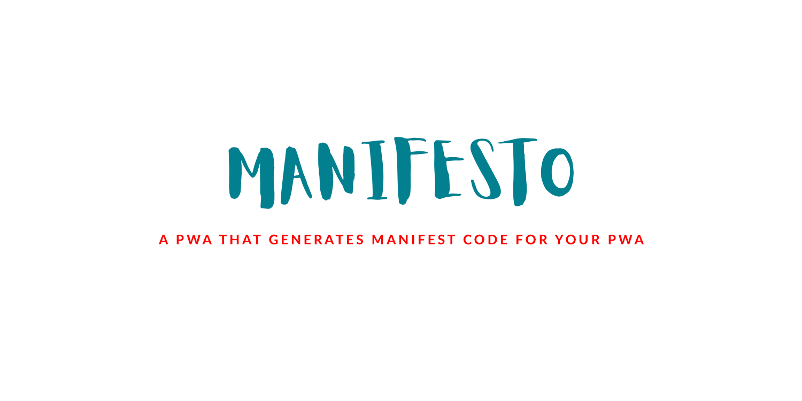
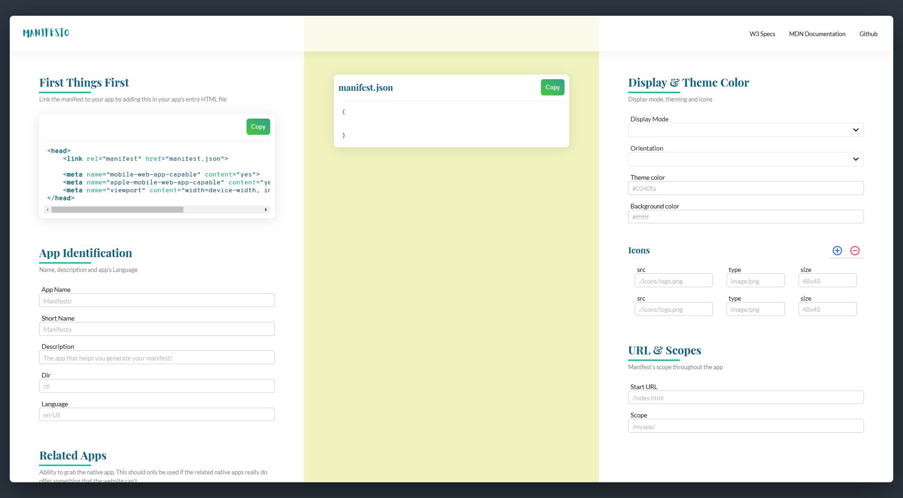

# [](https://github.com/blurdylan/manifesto-cli)

> ⚡️ A PWA that helps generate a manifest file for your PWA.

[](https://twitter.com/dylantientcheu) [](https://github.com/blurdylan/manifesto/graphs/commit-activity) [](https://github.com/blurdylan/manifesto/blob/master/license) 

## Table of Contents

- [Description](#description)
- [Installation](#installation)
- [Usage](#usage)
- [Examples](#examples)
- [License](#license)

## Description

[Manifesto](https://blurdylan.github.io/manifesto/#/) by [@dylantientcheu](https://twitter.com/dylantientcheu) is a beautiful PWA that will help you generate a manifest for your own PWA

`manifesto` gives you all the fields handled by a manifest along with documentation on each of them at your finger tips 😎.

Manifesto also works with the CLI 👉 [Manifesto CLI](https://github.com/blurdylan/manifesto-cli)


## Usage

Fields are filled according to the manifest you want to obtain.
Once the field is filled the entry gets added to the main code which is the manifest.



## Build

## Project setup

```bash
$ npm install
```

### Compiles and hot-reloads for development

```bash
$ npm run serve
```

### Compiles and minifies for production

```bash
$ npm run build
```

### Run your tests

```bash
$ npm run test
```

### Lints and fixes files

```bash
$ npm run lint
```

### Run your unit tests

```bash
$ npm run test:unit
```

## Built With

- [VueJS](https://vuejs.org/)
- [VueSax](https://lusaxweb.github.io/vuesax/)
- 💓

[](buymeacoff.ee/dylantientcheu)

## License

MIT © [Dylan Tientcheu](https://twitter.com/dylantientcheu)
