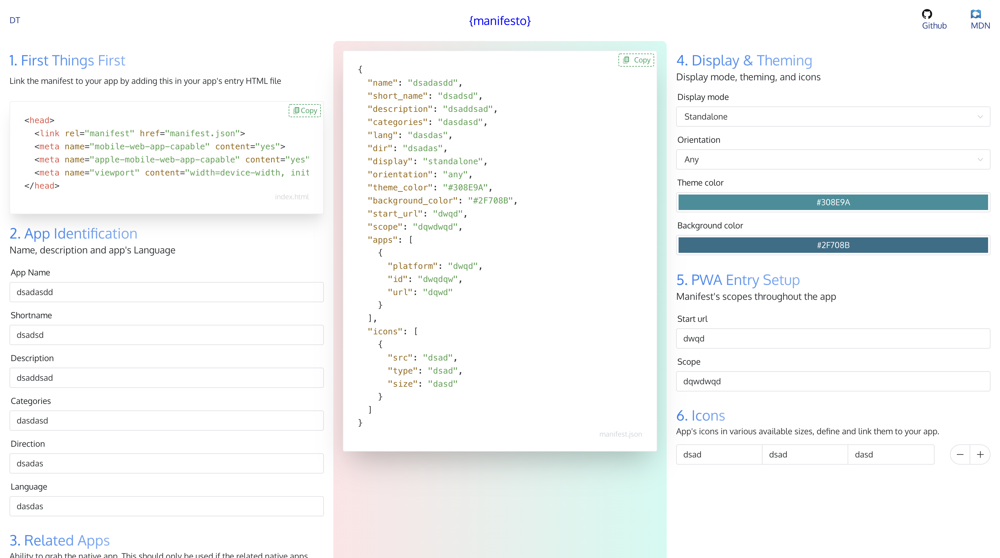

# [](https://github.com/blurdylan/manifesto-cli)

<p align="center">
<a href="https://twitter.com/dylantientcheu"></a> <a href="https://github.com/blurdylan/manifesto/graphs/commit-activity"></a> <a href="https://github.com/blurdylan/manifesto/blob/master/license"></a> 
</p>

---

> ⚡️ A PWA that helps generate a manifest file for your PWA.

## Table of Contents

- [Description](#description)
- [Installation](#installation)
- [Usage](#usage)
- [Examples](#examples)
- [License](#license)

## Description

[Manifesto](https://blurdylan.github.io/manifesto/#/) by [@dylantientcheu](https://twitter.com/dylantientcheu) is a beautiful PWA that will help you generate a manifest for your own PWA

`manifesto` gives you all the fields used by a manifest along with documentation to each of them at your finger tips 😎.

Manifesto also works with the CLI 👉 [Manifesto CLI](https://github.com/blurdylan/manifesto-cli)

## Usage

Fields are filled according to the manifest you want to obtain.
Once the field is filled the entry gets added to the main code which is the manifest.



## Build

## Project setup

```bash
npm install
```

### Compiles and hot-reloads for development

```bash
npm run serve
```

### Compiles and minifies for production

```bash
npm run build
```

## Built With

- [VueJS](https://vuejs.org/)
- [VueSax](https://www.naiveui.com/en-US/os-theme)
- 💓

## License

MIT © [Dylan Tientcheu](https://twitter.com/dylantientcheu)
